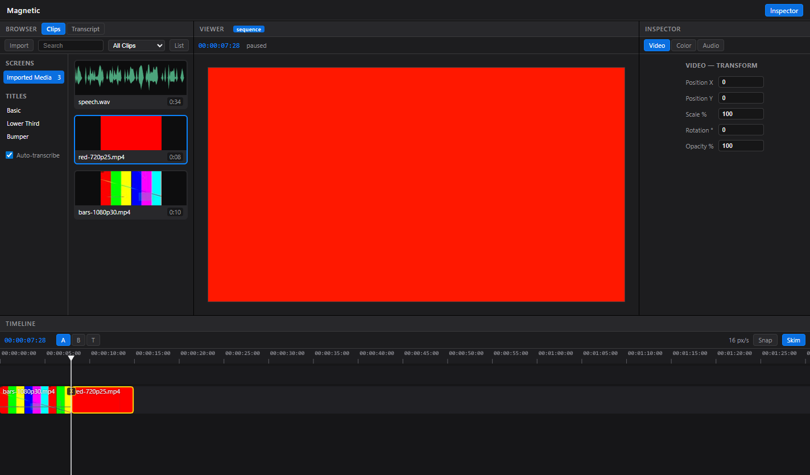
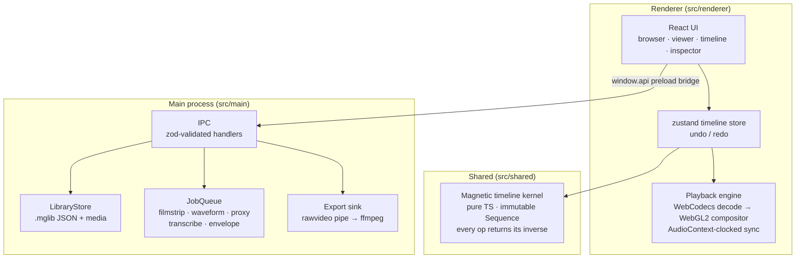
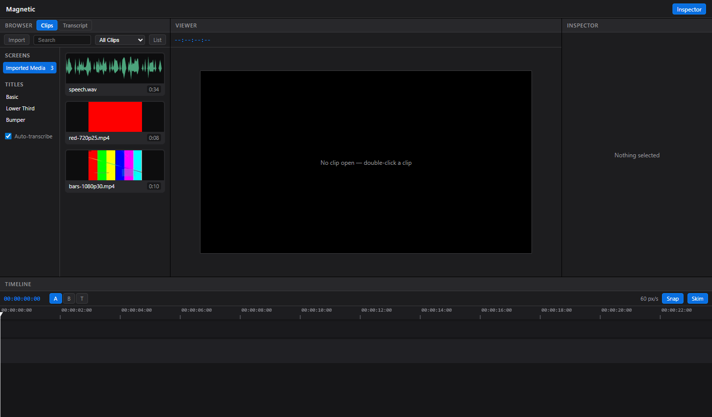
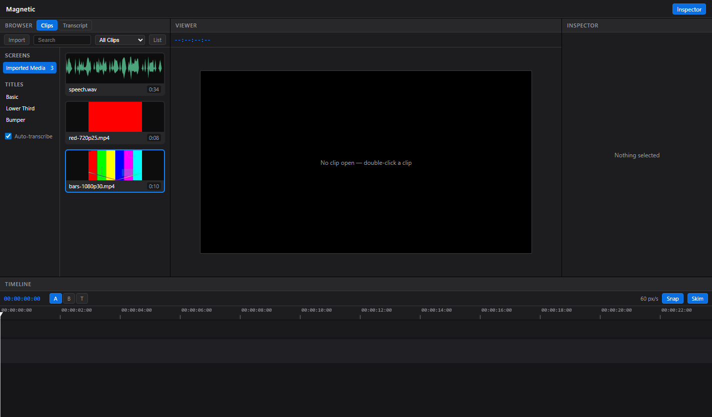
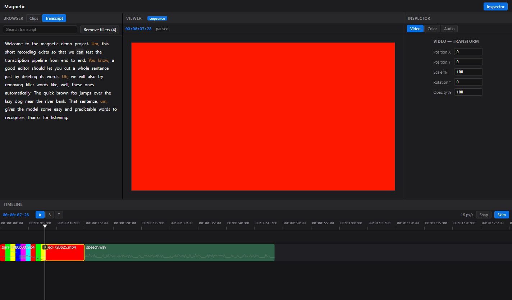
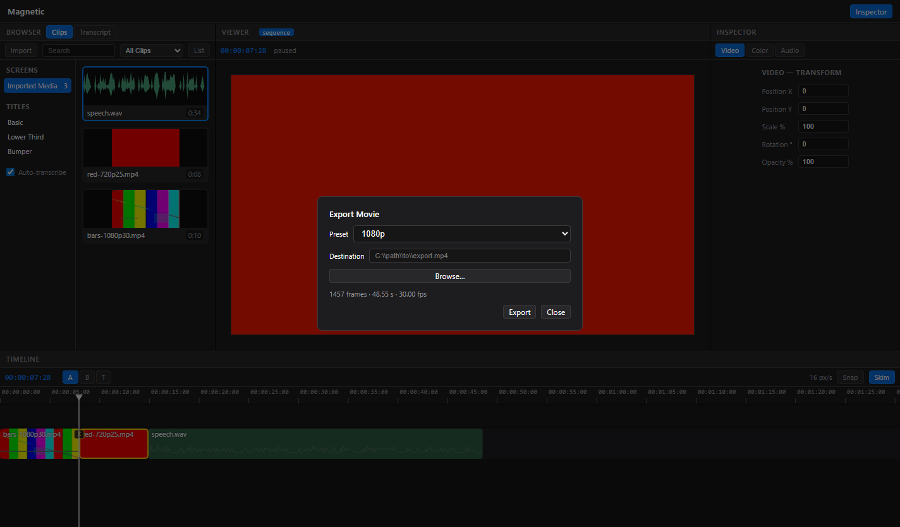
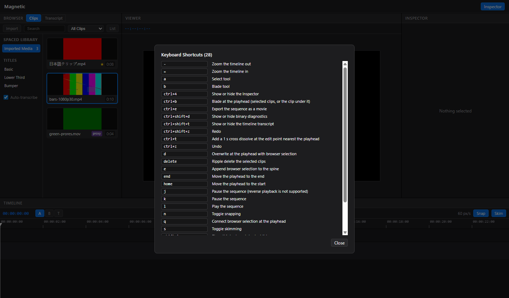
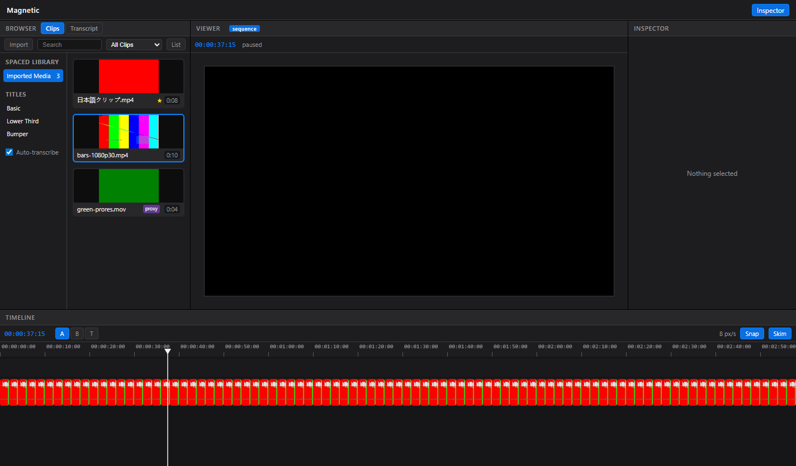

# Magnetic

A Final Cut Pro-style non-linear video editor for Windows, built with Electron, React, and TypeScript. Features a magnetic timeline, WebCodecs/WebGL2 playback, ffmpeg-powered import/export, and whisper.cpp-powered edit-by-transcript.



> Portfolio project. The design is an homage to Apple's Final Cut Pro — the magnetic timeline, three-panel layout, JKL transport, and edit grammar are modeled on it as the design reference. Not affiliated with Apple; no Apple trademarks are used and "Magnetic" is an original product name.

**New to Magnetic? Start with the [User Guide](docs/GUIDE.md)** — a five-minute first edit, the magnetic-timeline workflow, edit-by-transcript, and troubleshooting.

## Features

- **Library model** — Libraries → Events → Projects; import copies media into the `.mglib` bundle
- **Filmstrip browser** — hover-skim filmstrips, favorite/reject ratings, text search, background thumbnail/waveform generation
- **Viewer** — JKL transport (tap again for faster), frame-accurate stepping (`←`/`→`, ±10 with Shift), in/out marks, source/sequence timecode
- **Magnetic timeline** — spine + connected clips, lanes, gap clips, snapping, zoom, skimming; clips never overlap, edits ripple
- **Edit grammar** — append `E`, insert `W`, connect `Q`, overwrite `D`, ripple delete, lift; select `A` / blade `B` / trim `T` tools; trim ripples, edit points roll, clip bodies slip; drag-rearrange with magnetic collision; full undo/redo
- **Sequence playback** — WebCodecs decode → WebGL2 compositor; per-clip transforms (position/scale/rotation/opacity); AudioContext-clocked A/V sync
- **Keyframe animation** — animate transform, opacity, and color params from the Inspector (linear/smooth easing); diamonds on timeline clips; WYSIWYG in export
- **Clipboard** — copy/paste/duplicate clips (`Ctrl+C/V/D`), paste-connect (`Ctrl+Shift+V`), paste attributes incl. keyframes (`Ctrl+Alt+V`); one undo step per paste
- **Audio** — mixing, per-clip volume/pan, fade in/out
- **Detach audio & split edits** — pull audio onto its own lane and trim its edges independently for J-cuts and L-cuts
- **Transitions** — cross dissolve, wipe left/right, fade-to-black
- **Titles** — free text + 3 presets, rendered as live canvas layers
- **Color board** — exposure / contrast / saturation / temperature per clip
- **Export** — H.264/AAC MP4 at 1080p/720p/source via bundled ffmpeg, with progress and cancel; WYSIWYG (exported pixels match the live compositor)
- **Edit-by-transcript** — local whisper.cpp transcription, word-click seek, select-text-and-delete-to-cut, filler-word removal, transcript search
- **Auto silence removal** — background audio analysis, tunable dead-air detection with timeline preview, one-click jump-cuts, one-step undo
- **Captions** — burned-in captions derived live from the transcript (pop-in / karaoke / block presets); SRT/VTT sidecar export
- **Missing-media relink** — assets whose file vanished get an alert badge; relink accepts a replacement whose duration matches ±1 frame
- **Keyboard-shortcut overlay** — `Shift+?` lists every live binding
- **NSIS installer** — `npm run package`, binaries bundled

Explicitly out of scope: multicam, keyframe animation, color wheels/curves/scopes, proxy workflow (preview proxies for non-decodable codecs only), compound clips, 360°/HDR, plugins, Motion templates, ProRes encode, object tracking, collaboration.

## Requirements

- Windows 10/11 x64
- Node.js 24+, npm 10+

## Setup

```bash
# 1. Install dependencies
npm install

# 2. Fetch native binaries (ffmpeg, ffprobe, whisper.cpp, base.en model)
#    into resources/bin/ — pinned URLs, sha256-verified, idempotent
npm run fetch-binaries

# 3. Generate test media into fixtures/ (uses the fetched ffmpeg + Windows SAPI TTS)
npm run fixtures
```

## Development

```bash
npm run dev          # start electron-vite dev server + app (HMR)
```

## Build & test

```bash
npm run typecheck    # tsc across main, preload, renderer, shared, e2e
npm run lint         # eslint
npm test             # vitest unit tests
npm run build        # electron-vite production build -> out/
npm run test:e2e     # Playwright Electron E2E (requires `npm run build` first)
npm run package      # NSIS installer + win-unpacked -> dist/ (bundles resources/bin)
```

The installer bundles ffmpeg/ffprobe/whisper and the base.en model (~250 MB of binaries), so the packaged app has no first-run download. `e2e/packaged.spec.ts` boots `dist/win-unpacked/Magnetic.exe` and verifies the bundled binaries resolve; it is skipped until `npm run package` has produced that output.

## Scripts

| Script           | What it does                                                                |
| ---------------- | --------------------------------------------------------------------------- |
| `dev`            | Run the app in development with HMR                                         |
| `build`          | Production build to `out/`                                                  |
| `typecheck`      | Typecheck node (main/preload/shared/e2e) and web (renderer) projects        |
| `lint`           | ESLint over the repo                                                        |
| `test`           | Vitest unit tests (`src/**/*.test.ts`)                                      |
| `test:e2e`       | Playwright `_electron` E2E suite against the built app                      |
| `package`        | `electron-builder` NSIS installer into `dist/`                              |
| `fetch-binaries` | Download + sha256-verify ffmpeg/ffprobe/whisper/model into `resources/bin/` |
| `fixtures`       | Generate deterministic test media into `fixtures/`                          |
| `format`         | Prettier write                                                              |

## Keyboard shortcuts

Generated from the live shortcut registry (`scripts/dump-shortcuts.mjs`); `Shift+?` in the app shows the same list. Shortcuts are suppressed while typing in text fields. `J`/`K`/`L` and `Space` are contextual — they drive the source viewer when it has a clip open, otherwise the timeline.

| Shortcut                  | Action                                                          |
| ------------------------- | --------------------------------------------------------------- |
| `Space`                   | Play / pause (viewer or sequence)                               |
| `J`                       | Viewer: play reverse (again: faster) · Timeline: pause          |
| `K`                       | Pause                                                           |
| `L`                       | Play forward (again: faster)                                    |
| `←` / `→`                 | Step back / forward one frame                                   |
| `Shift+←` / `Shift+→`     | Step back / forward 10 frames                                   |
| `Home` / `End`            | Move the playhead to the start / end                            |
| `I` / `O` / `X`           | Mark in / mark out / clear in-out points                        |
| `E`                       | Append browser selection to the spine                           |
| `W`                       | Insert browser selection at the playhead                        |
| `Q`                       | Connect browser selection at the playhead                       |
| `D`                       | Overwrite at the playhead with browser selection                |
| `Delete`                  | Ripple delete the selected clips                                |
| `Shift+Delete`            | Lift the selected clips, leaving a gap                          |
| `A`                       | Select tool                                                     |
| `B`                       | Blade tool                                                      |
| `T`                       | Trim tool (edges ripple, edit points roll, body slips)          |
| `Ctrl+B`                  | Blade at the playhead (selected clips, or the clip under it)    |
| `Ctrl+T`                  | Add a 1 s cross dissolve at the edit point nearest the playhead |
| `Ctrl+Z` / `Ctrl+Shift+Z` | Undo / redo                                                     |
| `N`                       | Toggle snapping                                                 |
| `S`                       | Toggle skimming                                                 |
| `=` / `-`                 | Zoom the timeline in / out                                      |
| `Ctrl+4`                  | Show or hide the Inspector                                      |
| `Ctrl+E`                  | Export the sequence as a movie                                  |
| `Ctrl+Shift+T`            | Show or hide the timeline transcript                            |
| `Ctrl+Shift+D`            | Show or hide binary diagnostics                                 |
| `Shift+?`                 | Show the keyboard shortcut overlay                              |
| `Escape`                  | Return focus to browser                                         |

## Architecture



- `src/shared/timeline/` — the magnetic-timeline kernel: pure functions over an immutable `Sequence`; clip positions are derived by summation so overlaps are unrepresentable; every op returns its inverse for undo
- `src/main/` — Electron main process: window, menu, library persistence, background jobs, export; every IPC handler zod-validates its payload
- `src/preload/` — contextBridge bridge exposing the typed `window.api`
- `src/renderer/` — React UI (dark FCP-style 3-panel shell), zustand state, and the playback engine (WebCodecs decode, WebGL2 compositing, AudioContext-clocked sync)
- `scripts/` — binary fetcher, fixture generator, shortcut-table dump
- `e2e/` — Playwright Electron tests; `resources/bin/` and `fixtures/` are gitignored artifacts

Renderer security: `contextIsolation: true`, `nodeIntegration: false`, `sandbox: true`, CSP set in `index.html`, no remote URLs; library files are served over a custom `mfile://` protocol scoped to the library, except video/audio playback, which goes through a token-guarded loopback HTTP server (`src/main/media-server.ts`) because Chromium's media pipeline cannot seek large files through Electron custom-protocol responses. Ctrl+Shift+D toggles a diagnostics overlay that spawn-verifies the bundled binaries.

## Screenshots

|                                                                                                                 |                                                                                                      |
| --------------------------------------------------------------------------------------------------------------- | ---------------------------------------------------------------------------------------------------- |
|  Filmstrip browser — hover-skim, ratings, background jobs     |  Viewer — JKL transport, frame stepping, in/out marks          |
|  Edit-by-transcript — word-click seek, delete text to cut |  Export — H.264/AAC MP4 with progress + cancel   |
|  `Shift+?` overlay — every live binding               |  500-clip timeline — 0.7 ms median draw |

## Known limitations

- The "Explicitly out of scope" list above (multicam, keyframes, scopes, …) is deferred by design
- Reverse playback: `J` in the timeline pauses; true reverse playback is viewer-only
- 4K media plays at degraded fidelity (frame drops accepted; no proxy editing pipeline)
- Codecs WebCodecs cannot decode natively (e.g. ProRes) play through an auto-generated H.264 preview proxy; export always re-renders from source
- Export encodes H.264/AAC MP4 only; no ProRes/HEVC encode
- Windows-only: packaging, binary fetching, and E2E are wired for win32
